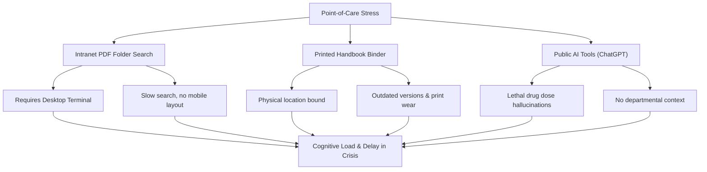

# AnaesSOP: Next-Generation Clinical Governance Portal & Cognitive Aid
### *Eliminating Point-of-Care Cognitive Load and Search Latency in Acute Care*

---

## 1. Executive Summary

In acute clinical environments (Anaesthetics, ICU, Emergency Medicine), rapid access to Standard Operating Procedures (SOPs) and drug dosing is a matter of patient safety. The current hospital setup relies on clunky intranets, printed binders, or unsecured public AI models that risk lethal dosage hallucinations. 

**AnaesSOP** is a secure, offline-first, mobile-friendly Clinical Portal and Progressive Web App (PWA) designed to put verified, hallucination-free guidelines and cognitive aids directly into clinicians' hands. By combining **local offline caching**, **department-grounded AI search**, **dynamic inline dose calculators**, and a **geofenced Trust Phonebook**, AnaesSOP reduces guideline-retrieval times from minutes to seconds.

---

## 2. The Core Problems Addressed

1. **Intranet Friction**: Intranet guidelines require logging into a desktop terminal. This is impossible at the patient’s bedside or in an active operating theatre.
2. **Horizontal Layouts & Unresponsive Formats**: Intranet portals render desktop layouts, forcing clinicians to pinch-zoom and scroll PDF columns under high-stress conditions.
3. **Version Control & Governance Fatigue**: Guideline updates require re-printing physical binders or uploading new files to disparate network shares, leading to clinicians utilizing outdated protocols.
4. **API Token Abuse & AI Hallucinations**: Using public LLMs (like ChatGPT) to query medical dosing is highly dangerous. General AI models frequently "hallucinate" math and decimals, introducing severe risks of medication errors.
5. **Paging and Switchboard Latency**: Standard phone sheets are static tables. Finding an emergency bleep or extension requires scrolling large lists, manual dialing, and waiting for operators, causing critical delay during resuscitation.

---

## 3. Key Features of AnaesSOP

### 🔒 Secure, Verified NHS Authentication
* **Clerk OTP Login**: Secure passwordless logins using NHS emails (`@nhs.net` or `.nhs.uk`).
* **Emergency Bypass Mode**: National crisis algorithms (Local Anaesthetic Toxicity, Malignant Hyperthermia, ALS) are hardcoded and accessible with *zero authentication* so they load instantly under shift stress.
* **Granular Role Controls**: Clinical governance leads and administrators can access a secure `/admin` upload portal to manage the guideline library.

### 🧠 Hallucination-Free AI Search (Grounded RAG)
* **Double-Layer Retrieval**: Combines a local client-side search index (Orama) with a cloud-based server-side Gemini 2.0 Flash LLM.
* **Grounded Context**: The AI is strictly bound to your department's uploaded PDFs. It generates responses with page-specific reference citations and direct links to open the original source PDF.
* **Escalated Search**: If offline search yields low confidence, clinicians can escalate to an online deep vector search with a single tap.

### 💾 Offline-First Progressive Web App (PWA)
* **Service Worker Caching**: The app shell is cached on the phone's browser. It works 100% offline in basement theatres, Lead-Lined MRI suites, and signal-dead hospital zones.
* **Short-Term Pinning**: Clinicians can "pin" up to 3 guidelines to download and cache source PDFs locally.

### 🧮 Grounded Inline Dose Calculators
* **Zero-Math Interface**: Dynamic, reactive calculators are embedded directly into guideline summaries (e.g. Dexmedetomidine infusions, Paediatric airway sizes).
* **discrete clinically safe rounding**: Rounding formulas conform to real-world medical sizes (e.g. ETT sizes round to the nearest `0.5mm`).
* **Audit Grounding**: Every calculator output points directly to the PDF page and bounding box from which the formula was derived.

### 📞 Active Geofenced Trust Phonebook
* **Fuzzy Directory Search**: Instant search for hospital extensions, departments, and pagers.
* **GPS Site Geofencing**: Integrates location tracking to auto-filter contacts by the clinician's active hospital site (e.g. St George's vs Queen Mary's).
* **Dialer Integration**: 
  * Tap extensions to dial immediately from a mobile phone (site prefixes are prepended automatically).
  * Tap pager bleeps to open a modal displaying bleep codes in large text, offering landline switchboard dial triggers.

### 📊 Clinical Governance & Quality Improvement (QI) Tools
* **Audit Review Date Reminders**: Tracks version control, publication dates, and upcoming "review due dates" (review cycle hashes) for all clinical SOPs. Helps governance leads proactively manage the document lifecycle with reminders before guidelines expire or lapse.
* **Clinical Gap Analysis**: Matches local guideline library coverage against national benchmarks (e.g. AAGBI, Resuscitation Council, and ACSA standards) to identify missing SOPs or outdated clinical pathways. Provides the clinical audit lead with an active dashboard checklist of "compliance gaps" that need to be addressed.

---

## 4. AnaesSOP vs. Traditional Setup

| Metric / Feature | Current Intranet / Binder Setup | Public AI (ChatGPT / Gemini) | **AnaesSOP Clinical Portal** |
|---|---|---|---|
| **Speed-to-Retrieval** | 3 - 5 minutes (Terminal search) | 30 - 60 seconds (App login) | **< 3 seconds (Offline-First)** |
| **Bedside Accessibility** | Low (Requires finding desktop) | Medium (Needs active cellular signal) | **High (PWA works on any device)** |
| **Offline Capability** | None (Fails if hospital network goes down) | None (Requires internet connectivity) | **Complete (Offline shell and cached PDFs)** |
| **Dosage Calculation Safety** | Manual calculation (Cognitive math error risk) | Very Low (High risk of mathematical hallucination) | **Guaranteed (Hardcoded rules & PDF grounded)** |
| **Bleep & Dialer Lookup** | Manual scrolling of printed boards / directory | None | **Instant (Fuzzy search + Tap-to-dial)** |
| **Clinical Governance** | Fragmented across intranet folders | Zero (No clinical control) | **Centralized (Verified admin upload portal)** |

---

## 5. Implementation Benefits & Return on Investment (ROI)

> [!IMPORTANT]
> **Safety and Audit Readiness**
> By digitizing guidelines and logging feedback directly to the clinical governance lead, AnaesSOP provides a clear audit trail for clinical governance audits (e.g., Anaesthetic Clinical Services Accreditation - ACSA).

1. **Reduced Clinical Error Rate**: Automating complex calculations (like paediatric emergency infusions or local anaesthetic toxicity volumes) removes human calculation errors under stress.
2. **Time Saved in Emergencies**: Locating switchboard numbers, bleep numbers, and emergency protocols in seconds rather than minutes improves outcomes in time-critical resuscitations.
3. **Frictionless Compliance**: Clinicians are more likely to reference official standard operating practices when they are accessible in their pocket rather than buried in network drives.
4. **Low Maintenance Cost**: The entire system is built using modern, highly optimized serverless infrastructure (Cloudflare D1/R2, Vercel, Clerk), meaning hosting costs for a department are near-zero.
